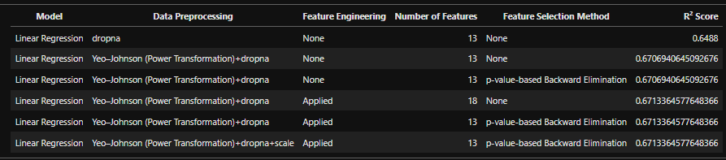

## California Housing Price Prediction

This project presents an end-to-end regression analysis on the California Housing dataset
using Linear Regression and Random Forest models.

### Key Steps
- Data cleaning and exploratory data analysis
- Distribution analysis and power transformations (Yeo–Johnson)
- Feature engineering and feature selection
- Model comparison and hyperparameter tuning

### Dataset
The dataset is downloaded programmatically from Kaggle using KaggleHub.

```python
import kagglehub
path = kagglehub.dataset_download("camnugent/california-housing-prices")

## Results:



